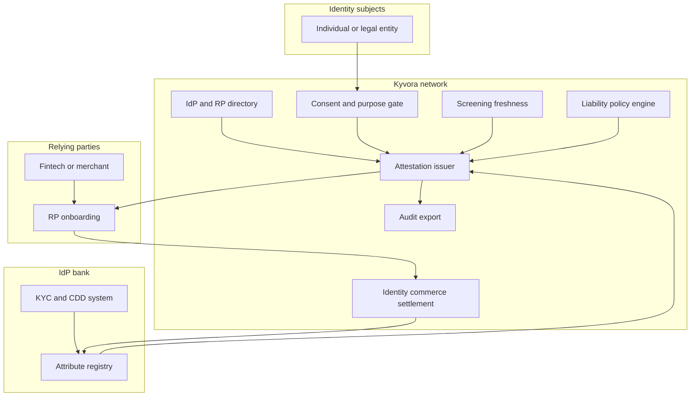

# Kyvora

**Source:** `ai-in-financial/WEF_A_Blueprint_for_Digital_Identity/`
**Domain:** `ai-fin`
**One-liner:** A bank-consortium reusable KYC attribute exchange that lets regulated identity providers sell consent-gated, assurance-levelled attestations to relying parties — with explicit liability allocation when an identity fails.
**Wedge:** Mid-to-large retail and SME banks in oligopoly markets (Nordics, Canada, Australia, UK) that already hold high-assurance customer attributes and want Identity-as-a-Service revenue without becoming a centralised data honeypot.
**Positioning:** Identity utility for financial institutions, not another consumer wallet. The WEF blueprint argues FIs must champion minimum-viable digital identity; Kyvora operationalises that call as a consortium network where banks are IdPs, fintechs and merchants are relying parties, and liability, assurance, and consent are first-class commercial objects — not afterthoughts in a SAML assertion.

## Market research synthesis

### Thesis from source

The August 2016 World Economic Forum blueprint (with Deloitte) argues that physical, siloed identity protocols are now the binding constraint on both Fintech innovation and core FI operations. Payments innovators must photograph driver’s licences or piggy-back on incumbent KYC; lenders decentralise a core part of their product by gathering identity through pseudo-digital channels; corporate banks struggle to attach directors to legal entities and to identify trading counterparties. Identity-dependent transaction volumes and complexity are rising, customer expectations demand seamless omni-channel proof, and regulators continue to hold FIs liable for mistakes — while physical documents remain forgeable, overexposing, and error-prone to transfer.

The commercially decisive insight is not “digitise the passport.” It is that FIs already sit on verified high-transaction-volume attributes (name, date of birth, nationality, national identifier, address) and can become Identity Providers in a network that also requires relying-party adoption, a consent-capable attribute-exchange platform, supervisory and liability standards, and legal acceptance of third-party-verified information. The report’s minimum-viable identity system is exactly that six-part checklist. Configuration options matter: single-institution systems struggle for critical mass; utilities fit legal-entity golden records; consortia fit individuals because data need not be centralised, improving privacy and resilience — the Finnish TUPAS case shows banks processing 95% of online service logins (versus 2% for a telecom competitor as of February 2016), with RPs paying initiation, monthly, and volume fees, and user approval of transferred data eliminating IdP liability risk for that assertion.

Benefits named for FIs span process streamlining (fewer RFIs and remediation), Identity-as-a-Service and identity-only customers as new revenue, liability reallocation away from FIs when users approve and consent, trust brokerage beyond FS, and potential disruption of credit-bureau models. Inclusion evidence is concrete: India’s Aadhaar programme enrolled over 1 billion people for accounts as a financial-inclusion instrument. The product therefore sells reusable, purpose-limited attestations with assurance levels and liability rules — not another copy of the customer’s documents into every fintech’s vault.

### Buyer & economic model

- **Primary buyer:** Chief Compliance Officer / Head of KYC Operations jointly with Chief Strategy Officer at a retail or SME bank ready to join or sponsor a national/regional identity consortium.
- **Users:** KYC analysts and CDD refresh teams (daily), onboarding product owners at relying parties (fintechs, insurers, telcos, public-service portals), consent/privacy officers, consortium network operators, and regulators reviewing assurance and liability evidence.
- **Budget owner / value metric:** Compliance and onboarding cost budget on the IdP side; customer-acquisition and KYC cost on the RP side. Value metrics are cost per completed onboarding, share of onboardings settled via reusable attestation (vs document re-collection), CDD refresh cycle time, and IdP per-transaction identity revenue (TUPAS-style fee model).
- **Competing status quo:** Repeat KYC per institution (document upload, manual review, sanctions screening from scratch), bilateral bank APIs without liability standards, government eID schemes that banks consume but do not monetise, and credit-bureau / data-broker enrichment that expands rather than minimises data held.

### Domain constraints

- **Regulatory / trust / safety:** AML/KYC/CDD obligations and refresh cycles remain with the regulated entity that onboarded the customer for financial products; identity failure liability must be contractually allocated between IdP, RP, and user; sanctions screening currency; eIDAS-style trust frameworks and mutual recognition; identity assurance levels must match product risk (opening a savings account ≠ wire corridor access).
- **Data sensitivity:** Attribute exchange must be consent-gated and purpose-limited; RPs receive only the attributes required for the transaction (data minimisation); no creation of a single central PII lake if the consortium model is chosen; breach and misuse create existential trust failure.
- **Change-management realities:** Banks will not abandon core KYC systems; Kyvora must run as a reusable layer on top of existing CDD. RPs need legal comfort that third-party-verified attributes satisfy their supervisors. Consortium governance (who admits IdPs/RPs, who sets assurance criteria) is as hard as the technology.

## Business requirements

- BR-1: Every attestation released to a relying party must declare an identity assurance level, the verifying IdP, the attribute set, the purpose, and the user’s consent timestamp — and must be refuseable if any of those fields is missing.
- BR-2: Relying parties must complete eligible onboardings without re-collecting documents already verified by a participating IdP at equal or higher assurance, unless a policy exception (sanctions hit, material change, expired attestation) is recorded.
- BR-3: Liability for incorrect attributes must be contractually allocated and machine-readable on each attestation (IdP, RP, or user-approved transfer), so disputes do not default to “the bank always pays.”
- BR-4: IdPs must be able to price Identity-as-a-Service per initiation, per period, and per attestation volume, with invoices that finance can recognise as non-interest fee income.
- BR-5: CDD refresh and ongoing monitoring must support time-boxed attestation expiry and forced re-verification when sanctions lists, address, or beneficial-ownership signals change — reusable KYC is not “verify once forever.”
- BR-6: Attribute release must enforce data minimisation: only attributes required for the declared purpose may leave the IdP boundary; over-broad requests must be rejected or narrowed with user consent.
- BR-7: Legal-entity and individual identity must be linkable (director to company) for corporate onboarding without collapsing both into a single undifferentiated profile.
- BR-8: Undocumented or thin-file individuals must have an inclusion path (assured alternative evidence tiers) that does not silently lower assurance for high-risk products.
- BR-9: Consortium operators must admit, suspend, and certify IdPs and RPs against published supervisory and liability standards, with an auditable decision trail.
- BR-10: Every identity decision (issue, release, refuse, revoke, dispute) must be exportable for regulator examination and internal audit within the jurisdiction’s retention window.
- BR-11: Sanctions and PEP screening status must be fresh relative to the attestation’s validity window; stale screening cannot travel as a “clean” attestation.
- BR-12: Users must be able to view, approve, and revoke sharing relationships; silent secondary use of attributes by RPs is a policy violation that triggers attestation revocation eligibility.

## User stories

Canonical user stories live in sibling [USER_STORIES.md](USER_STORIES.md).

## System design

### Overview

Kyvora is a consortium attribute-exchange network. Participating banks (IdPs) register verified attributes and assurance metadata derived from their regulated CDD processes. Relying parties request purpose-scoped attestations; the subject consents; Kyvora brokers a minimised, signed attestation with liability terms and screening freshness — without copying the full customer dossier to the RP. Ongoing monitoring invalidates or refreshes attestations; disputes and revocations propagate to dependent onboardings. Commercial settlement bills RPs and pays IdPs on the TUPAS-like fee model the source documents.

### Actors & boundaries

- **Actors:** identity subject (individual or legal entity), IdP bank, relying party, consortium operator, sanctions/screening providers, supervisors (read-only audit).
- **Trust boundary:** raw PII and full CDD files remain inside the IdP. What crosses the boundary is a signed attestation payload (attributes + assurance + consent + liability + screening currency). The consortium operator sees network metadata and settlement, not wholesale customer databases.
- **Human-in-the-loop points:** enhanced due diligence fallbacks; IdP/RP certification and suspension; dispute adjudication; inclusion-path exception approvals; material change reviews on refresh.

### Core capabilities

1. **IdP and RP directory** — certification, assurance capabilities, fee schedules, suspension.
2. **Attribute registry** — verified attributes with provenance and assurance level (no central honeypot of full dossiers).
3. **Consent and purpose gating** — subject approval, purpose limitation, revocation.
4. **Attestation issuance and exchange** — minimised, signed, time-boxed attestations to RPs.
5. **Liability policy engine** — machine-readable allocation per attestation and network rulebook.
6. **Screening freshness and CDD refresh** — sanctions/PEP currency, expiry, forced re-verify.
7. **Legal-entity linkage** — directors/UBOs to corporate identities.
8. **Dispute, revoke, and freeze** — incorrect-attribute handling and dependent-onboarding freeze.
9. **Identity commerce settlement** — RP billing and IdP payout for Identity-as-a-Service.
10. **Audit and supervisory export** — evidence packs for exams and internal audit.

### Conceptual data

- **Primary entities:** IdentityProvider, RelyingParty, IdentitySubject, AttributeRecord, AssuranceLevel, ConsentGrant, Attestation, LiabilityAllocation, ScreeningSnapshot, RefreshCycle, LegalEntityLink, DisputeCase, FeeSchedule, SettlementInvoice, NetworkMembership.
- **Critical events:** attribute verified, consent granted/revoked, attestation issued/refused/expired, screening refreshed, dispute opened/resolved, membership suspended, invoice settled.
- **Retention / audit needs:** attestations, consents, liability terms, and dispute outcomes retained for AML and civil-liability windows; raw source documents remain at IdP under existing KYC retention; network logs retained for supervisory reconstruction.

### Integrations (conceptual)

- **Systems of record:** IdP core KYC/CDD and customer master; RP onboarding/LOS; consortium billing/ERP.
- **Upstream signals:** sanctions and PEP lists, national ID / eIDAS nodes, credit-bureau and registry lookups used only inside IdP verification — not re-sold wholesale through Kyvora.
- **Downstream actions:** RP account opening decisioning, IdP fee revenue recognition, attestation revocation webhooks, supervisory exam exports.

### High-level architecture

Consent and minimisation sit on the hot path; liability and settlement sit on the durable commercial path. IdP systems never export full dossiers — only attestations.

### Success metrics

- **Leading:** share of RP onboardings completed via attestation vs document upload; median time from request to consented attestation; consent grant rate; screening-staleness rejection rate; inclusion-path completion rate.
- **Lagging:** IdP Identity-as-a-Service fee income; RP cost per acquired customer versus prior KYC stack; dispute rate and mean time to freeze dependent onboardings; supervisory findings related to third-party identity reliance; network concentration (avoid single-IdP dominance).

## OpenAPI skeleton

Canonical HTTP surface lives in sibling [openapi.yaml](openapi.yaml). Summary:

- **Base path:** `/v1/...`
- **Auth:** `X-API-Key` for IdP/RP server integration; Bearer JWT for consortium and compliance operators.
- **Resource groups:** Directory, Subjects, Consents, Attestations, Screening, Disputes, Settlement.
