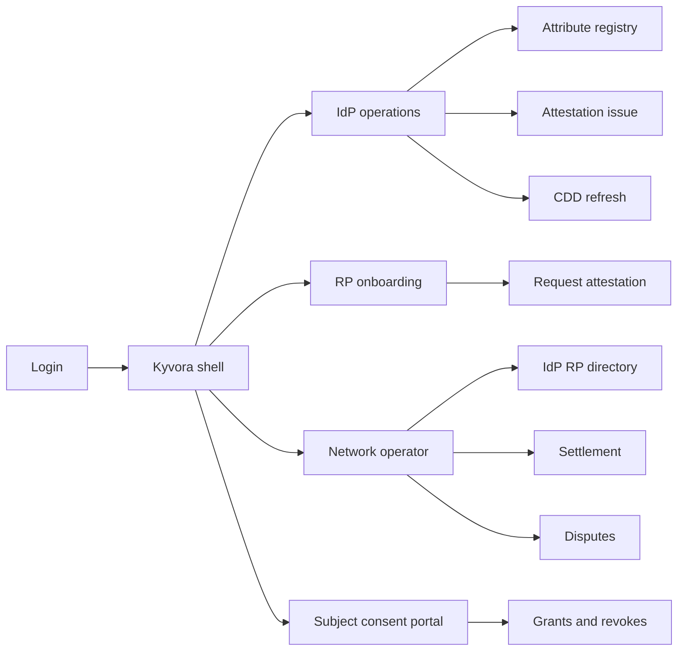
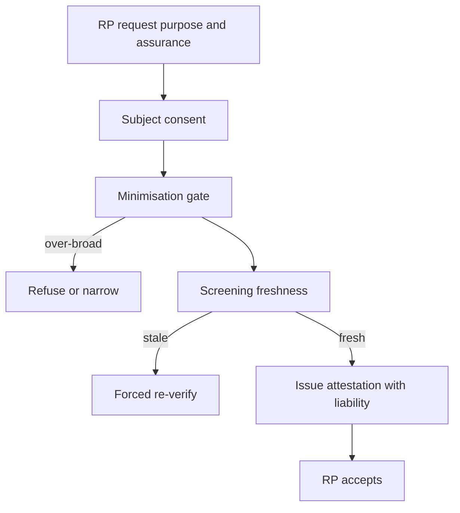

# Kyvora — Web app

**Product:** [PRODUCT.md](./PRODUCT.md)
**Primary surface:** Consortium identity-network console (IdP bank ops + RP onboarding + network operator workspaces)
**Secondary surfaces:** Subject consent portal (approve/revoke sharing); supervisory evidence pack viewer (read-only)
**Design thesis:** Kyvora is a sealed notary desk for reusable KYC — the UI metaphor is assurance-stamped attestations and liability clauses, not a consumer wallet or selfie onboarding carnival. Visual language is deep indigo vault panels with crisp white certificate fields and brass assurance seals: consent feels like a signed slip; over-broad attribute requests feel refused at the gate; stale screening feels void. The Kyvora wordmark sits as a quiet network seal on every attestation and settlement screen so IdPs and RPs know whose liability rulebook they are trading under.

## UX research synthesis

### Category peers (best-in-class)

- **BankID / TUPAS / MitID operator portals:** High-assurance bank IdP patterns with RP billing and user approval of transferred data. Steal: initiation/monthly/volume fee commerce and user-approved release eliminating silent IdP liability; reject consumer “super-app” clutter in the operator console.
- **Onfido / Jumio studio (RP side):** Assurance-tiered verification outcomes and clear decline reasons. Steal: insufficient-assurance fallback messaging; reject document-recollection as the happy path when attestation exists (BR-2).
- **Okta / Auth0 admin (directory & certification):** Member admit/suspend with audit trail. Steal: IdP/RP certification lifecycle (BR-9); reject equating login SSO with KYC attestations.
- **TrueLayer / open-banking consent UXs:** Purpose-limited sharing with revoke. Steal: attribute minimisation and subject revoke (BR-6, BR-12); reject unlimited continuous access framing for KYC attestations.

### Patterns to adopt / reject

- **Adopt:** Attestation as commercial object (assurance + IdP + attributes + purpose + consent + liability); refuse incomplete payloads; data minimisation gate; screening freshness window; legal-entity links; inclusion tiers without silently lowering high-risk assurance; dispute freeze of dependent onboardings; IaaS settlement invoices.
- **Reject:** Central PII lake UI; selfie-first as brand; purple “trust score” without assurance level; silent secondary use; verify-once-forever; document vault copies as default RP integration.

### Trust, density, and workflow constraints from PRODUCT.md

Raw CDD stays at IdP — only signed attestations cross (trust boundary). AML/CDD obligations remain with regulated product onboarder; liability must be machine-readable (BR-3). Assurance must match product risk. Consortium governance is as hard as tech (BR-9). Inclusion path must not silently weaken high-risk products (BR-8). Supervisors need evidence packs without email archaeology (BR-10).

## Information architecture

### Nav model

### Roles → default home

| Role | Default home | Why |
|------|--------------|-----|
| KYC ops lead (IdP) | IdP operations — refresh + issue queue | Reuse CDD, don’t re-check forever (BR-5) |
| RP onboarding manager | RP request console | Purpose-scoped assurance (BR-1, BR-2) |
| End customer | Consent portal | Approve/revoke attributes (BR-12) |
| Consortium operator | Directory + settlement | Admit/suspend + IaaS market (BR-4, BR-9) |
| Compliance / privacy | Evidence packs / disputes | Supervisor-ready (BR-10) |

### Cross-links to OpenAPI resources

| Nav area | OpenAPI tags / resources |
|----------|---------------------------|
| IdP / RP membership | Directory |
| Subjects / attributes | Subjects |
| Consent grants / revokes | Consents |
| Attestation exchange | Attestations |
| Sanctions / PEP freshness | Screening |
| Incorrect-attribute cases | Disputes |
| IaaS fees / invoices | Settlement |

## Screen inventory

### IdP operations home

- **Purpose:** Issue reusable attestations from existing CDD; see refresh and refuse queues.
- **Entry:** IdP login default.
- **Layout regions:** Brand seal; attestation volume vs fee income strip; refresh due; over-broad request refusals; dispute freezes affecting IdP.
- **Primary actions:** Open issue queue; open refresh; export fee report.
- **Empty / loading / error:** Empty = certify IdP membership first; error = retry with request id.
- **BR / story ties:** BR-4, BR-5; KYC ops stories.

### Attribute registry (IdP-bound)

- **Purpose:** Verified attributes with provenance and assurance — not a central honeypot browser for the network.
- **Entry:** IdP nav; subject search (ACL).
- **Layout regions:** Subject header; attribute table (level, verified-at, source); legal-entity links; inclusion-tier marker.
- **Primary actions:** Mark verified; link director↔entity; open inclusion exception.
- **Empty / loading / error:** Network operators cannot dump full dossiers — scoped views only.
- **BR / story ties:** BR-7, BR-8; trust boundary.

### Attestation issue / refuse

- **Purpose:** Build minimised attestation with assurance, purpose, consent, liability, screening freshness — refuse if incomplete.
- **Entry:** From RP request; IdP issue queue.
- **Layout regions:** Required vs requested attributes; minimisation diff; consent timestamp; liability allocation clause; screening currency badge; refuse reasons.
- **Primary actions:** Issue signed attestation; refuse; narrow attributes with new consent.
- **Empty / loading / error:** Missing any BR-1 field = hard refuse state.
- **BR / story ties:** BR-1, BR-3, BR-6, BR-11.

### RP onboarding request console

- **Purpose:** Request purpose-scoped attestation at stated assurance; clear decline when insufficient.
- **Entry:** RP default.
- **Layout regions:** Purpose picker; assurance required; attribute checklist; liability preview; fallback EDD path; accepted attestation viewer.
- **Primary actions:** Submit request; accept attestation; start EDD fallback; open account decisioning hook.
- **Empty / loading / error:** Policy exception required to re-collect documents when attestation valid (BR-2).
- **BR / story ties:** BR-2, BR-3; RP manager stories.

### Subject consent portal

- **Purpose:** Approve exactly which attributes go where; revoke sharing relationships.
- **Entry:** Subject login / magic link from request.
- **Layout regions:** Pending approvals; active relationships; attribute toggles; revoke controls; plain-language purpose.
- **Primary actions:** Approve; narrow; revoke; view history.
- **Empty / loading / error:** No silent defaults to “select all” (BR-6, BR-12).
- **BR / story ties:** BR-12; end customer stories.
- **Mobile notes:** Primary subject surface must work on mobile; large approve/revoke targets.

### Screening freshness

- **Purpose:** Sanctions/PEP status fresh relative to attestation validity; stale cannot travel clean.
- **Entry:** IdP refresh; attestation gate.
- **Layout regions:** Screening snapshot age; validity window; forced re-verify queue; block banner when stale.
- **Primary actions:** Refresh screen; invalidate attestations; notify RPs.
- **Empty / loading / error:** Stale = coral void seal (BR-11).
- **BR / story ties:** BR-5, BR-11.

### CDD refresh cycles

- **Purpose:** Time-boxed expiry and forced re-verify on material change — not verify once forever.
- **Entry:** IdP refresh queue.
- **Layout regions:** Expiry calendar; change signals (address, UBO, sanctions); dependent RP list.
- **Primary actions:** Force re-verify; extend per policy; notify RPs of invalidation.
- **Empty / loading / error:** Empty queue = healthy message.
- **BR / story ties:** BR-5.

### Legal-entity linkage

- **Purpose:** Attach directors/UBOs to companies without collapsing profiles.
- **Entry:** Subject registry; corporate onboarding.
- **Layout regions:** Entity graph; role edges; assurance per node; dual navigation individuals↔entities.
- **Primary actions:** Link; unlink with audit; open attestation for entity purpose.
- **Empty / loading / error:** Orphan director = amber incomplete corporate pack (BR-7).
- **BR / story ties:** BR-7.

### Directory and certification (network ops)

- **Purpose:** Admit, suspend, certify IdPs/RPs against published standards with auditable trail.
- **Entry:** Network operator home.
- **Layout regions:** Member table; assurance capabilities; fee schedules; suspension controls; decision audit.
- **Primary actions:** Certify; suspend; publish rulebook version; view decision trail.
- **Empty / loading / error:** Suspended member cannot issue/accept (BR-9).
- **BR / story ties:** BR-9; operator stories.

### Disputes and freeze

- **Purpose:** Incorrect-attribute investigation freezes dependent onboardings.
- **Entry:** Compliance; dispute webhook.
- **Layout regions:** Case queue; attestation under dispute; dependent RP onboardings freeze list; time box; resolution log.
- **Primary actions:** Open dispute; freeze; resolve; revoke attestation.
- **Empty / loading / error:** Expired time box escalates (compliance story).
- **BR / story ties:** BR-10; compliance dispute story.

### Settlement and invoices

- **Purpose:** TUPAS-like initiation/period/volume fees as recognisable IdP fee income.
- **Entry:** Network ops / IdP finance.
- **Layout regions:** Fee schedule; volume; invoices; payout status; RP billing.
- **Primary actions:** Generate invoice; export to ERP; adjust schedule (governance).
- **Empty / loading / error:** Settlement failure with retry and ticket id (BR-4).
- **BR / story ties:** BR-4.

### Supervisory evidence pack

- **Purpose:** Consent, purpose, assurance, screening freshness, liability for any onboarding — no email reconstruction.
- **Entry:** Compliance export.
- **Layout regions:** Pack builder; artefact list; download; retention window note.
- **Primary actions:** Generate; download; share with supervisor channel.
- **Empty / loading / error:** Incomplete pack = block download with missing field list (BR-10).
- **BR / story ties:** BR-10.

## Key flows

1. **Consented attestation onboarding** — RP requests purpose+assurance → subject consents minimised attributes → IdP checks screening → issues attestation with liability → RP accepts; failure: refuse incomplete or over-broad.

2. **Document-free path** — valid attestation at equal/higher assurance → RP skips document re-collection unless recorded exception (BR-2).

3. **Refresh invalidation** — material change or expiry → invalidate → notify RPs → freeze dependents if disputed.

4. **Dispute freeze** — incorrect attribute → open case → freeze dependent onboardings → resolve/revoke.

5. **Member suspension** — assurance breach → suspend IdP/RP → block issue/accept → audit trail (BR-9).

## Design system

### Tokens (CSS variables)

- `--color-ink: #0E1420` — text on certificate fields
- `--color-certificate: #F7F8FA` — attestation paper ground
- `--color-vault: #1A2740` — shell / brand indigo
- `--color-brass: #B8944A` — assurance seal accent
- `--color-refuse: #C2473D` — refuse / stale / freeze
- `--color-amber: #C4922A` — pending consent / provisional
- `--color-valid: #2F6B56` — issued / consented
- `--color-steel: #6A7688` — secondary labels
- `--font-display: "Source Serif 4", serif` — attestation titles and seals
- `--font-body: "IBM Plex Sans", sans-serif` — console
- `--font-mono: "IBM Plex Mono", monospace` — attestation ids, liability clause ids
- `--space-1`…`--space-8`: 4px scale
- `--radius-sm: 2px`; `--radius-md: 6px` — certificate-sharp
- `--motion-seal: 180ms ease-out` — issue confirm
- `--motion-refuse: 220ms ease-in-out` — refuse banner
- `--motion-consent: 160ms ease-out` — approve flash
- Atmosphere: vault indigo shell; certificate white panels; brass rules; no selfie heroes in operator UI; no purple wallet gradients.

### Typography & brand

- Serif for attestation certificates; sans for ops tables; mono for ids and liability machine terms.
- Kyvora network seal on attestation and settlement views; subject portal brand-first with one job (approve/revoke); login headline (“Reusable KYC attestations with liability”); one CTA.

### Do / don’t

- **Do:** Show liability on every attestation; minimise attributes; void stale screening; freeze dependents on dispute; bill IaaS explicitly.
- **Don’t:** Purple trust orbs; central PII browser for all members; select-all consent defaults; verify-forever; document upload as default happy path when attestation exists.

### Accessibility & domain trust cues

- Assurance seals use text levels (e.g. “IAL2”) not colour alone; live regions for revoke and freeze.
- Focus order on subject portal: purpose → attributes → approve.
- Evidence packs accessible download; high contrast on vault/certificate.

## Component patterns

- **AttestationCertificate** — assurance, IdP, attributes, purpose, consent time, liability, screening currency.
- **MinimisationDiff** — requested vs allowed attributes.
- **LiabilityClauseBlock** — machine-readable IdP/RP/user allocation.
- **ScreeningFreshnessBadge** — valid / stale / re-verify.
- **ConsentGrantCard** — purpose-limited approve/revoke.
- **LegalEntityLinkGraph** — director/UBO edges.
- **InclusionTierMarker** — alternative evidence without silent downgrade.
- **MemberCertificationRow** — admit/suspend with audit.
- **DisputeFreezeBanner** — dependent onboarding freeze.
- **IaaSInvoiceLine** — initiation / period / volume fees.

## Out of scope for v1 web

- Consumer crypto wallet; replacing IdP core KYC systems of record; government eID issuance; credit-bureau wholesale resale UI; native mobile IdP analyst apps beyond subject consent; selfie/document capture studio as primary product surface.
